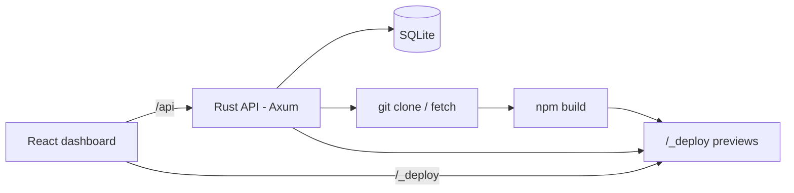

# Flare

A Vercel-like deployment platform written in **Rust** (backend) and **React** (frontend).

Link public GitHub repositories (no OAuth / API keys required), detect commits and file changes, run automated builds, and serve preview deployments.

## Architecture



See [docs/ARCHITECTURE.md](docs/ARCHITECTURE.md) for components, data model, Docker topology, and API notes.

For **`curl` recipes** (link public repos, deploy, logs, promote, export/import): [docs/CLI.md](docs/CLI.md).

## Features

- **Public GitHub linking** — paste any public repo URL; Flare clones via `git` (no credentials)
- **Auto builds** — poll for new commits (interval configurable in **Settings** / SQLite)
- **Change detection** — commit diffs and changed-file lists per deployment
- **Framework detection** — static sites, Vite, Next.js, Create React App, and more
- **Preview deployments** — unique URL per deployment under `/_deploy/<id>/`
- **Build logs** — streaming / stored logs in the dashboard
- **Projects dashboard** — manage projects, env vars, redeploys
- **Deploy hooks** — outgoing webhooks on `deployment.queued` / `ready` / `error`
- **Custom domains** — map a host to a project; serve latest ready deploy by `Host` header
- **Build cancel** — cancel queued/building deployments (best-effort)
- **Docker Compose** — multi-stage Rust image (with git + node) + nginx frontend
- **Strict CI** — PR checks on `main` / `develop`

## Quick start

### Makefile (recommended)

```bash
make dev-api   # backend on http://127.0.0.1:8080
make dev-ui    # frontend on http://127.0.0.1:5173
make test      # cargo test + frontend build
make lint      # fmt check, clippy -D warnings, frontend lint
```

### Backend

```bash
cd backend
cargo run
# API listens on http://127.0.0.1:8080
```

### Frontend

```bash
cd frontend
npm install
npm run dev
# UI on http://127.0.0.1:5173 (proxies /api and /_deploy to the API)
```

### Docker Compose

```bash
docker compose up --build
# UI:  http://localhost:3000
# API: http://localhost:8080
```

The backend image includes **git** and **node/npm** so it can clone public repos and run npm builds. The frontend image serves the Vite production build via **nginx** and proxies `/api` and `/_deploy` to the backend.

## Link a public repo

In the dashboard: **New Project** → paste `owner/repo` or a full GitHub URL → Flare clones and builds.

### Example public repos (small / static-friendly)

| Repo | Why it’s a good demo |
|------|----------------------|
| [`mdn/beginner-html-site`](https://github.com/mdn/beginner-html-site) | Tiny static HTML site |
| [`mdn/beginner-html-site-styled`](https://github.com/mdn/beginner-html-site-styled) | Static HTML + CSS |
| [`vercel/next.js`](https://github.com/vercel/next.js) | Large Next.js monorepo (heavier build) |
| [`withastro/astro`](https://github.com/withastro/astro) | Astro framework examples |

Prefer small static repos for the fastest first deploy when trying Flare locally.

## Settings

Open **Settings** in the UI (`/settings`) or call:

- `GET /api/settings`
- `PATCH /api/settings` with `{ "poll_interval_secs": 60 }`

Values are stored in the SQLite `settings` table (default poll interval: 60 seconds, minimum 5).

## Deploy hooks (outgoing webhooks)

Per project, register URLs that receive a JSON POST when a deployment status changes:

- `deployment.queued`
- `deployment.ready`
- `deployment.error`

```http
GET/POST /api/projects/{id}/webhooks
DELETE   /api/projects/{id}/webhooks/{webhook_id}
```

POST body for create: `{ "url": "https://…", "events": ["deployment.ready"] }` (omit `events` for all). No signing secrets in this MVP; delivery is fire-and-forget via `reqwest`.

## Custom domains (local mapping)

Map a hostname to a project. When a request’s `Host` header matches, Flare serves the project’s **latest ready** deployment (same files as `/_deploy/<id>/`).

```http
GET/POST /api/projects/{id}/domains
DELETE   /api/projects/{id}/domains/{domain_id}
```

This is **local mapping only** — Flare does not provision DNS or TLS. For real use, point DNS (or add an `/etc/hosts` entry on your machine) at the Flare API host/port, then open `http://your-host/`.

Example `/etc/hosts`:

```
127.0.0.1  my-app.local
```

Then add domain `my-app.local` on the project and visit `http://my-app.local:8080/`.

## Build cancel

```http
POST /api/deployments/{id}/cancel
```

Sets status to `cancelled` when the deployment is `queued` or `building`. The worker checks for cancel before heavy steps (best-effort; an in-flight shell command may still finish).

## Branches

| Branch | Purpose |
|--------|---------|
| `main` | Stable releases |
| `develop` | Integration branch |
| `feature/*` | Feature work via PRs |

## License

MIT
