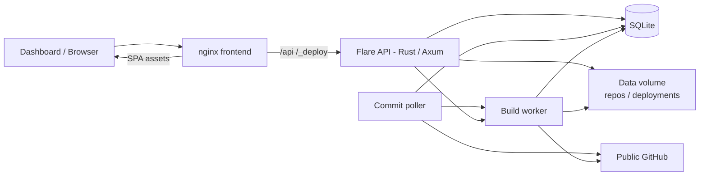
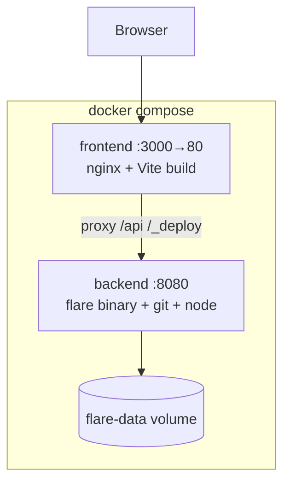

# Flare Architecture

Flare is a lightweight, Vercel-like deployment platform for **public GitHub repositories only**. There is no OAuth, no GitHub App, and no API keys — repos are cloned over HTTPS with plain `git`.

## High-level overview



## Components

| Component | Tech | Role |
|-----------|------|------|
| **Frontend** | React + Vite | Projects dashboard, deployments, env vars, settings |
| **API** | Rust, Axum, SQLx | REST API under `/api/*`; serves preview assets under `/_deploy/*` |
| **SQLite** | `flare.db` under `FLARE_DATA_DIR` | Projects, deployments, build logs, env vars, settings |
| **Poller** | Tokio background task | Periodically `git fetch`es public remotes; queues builds on new SHAs |
| **Build worker** | Tokio + shell (`npm`, etc.) | Runs install/build, copies output into deployment dirs |
| **Docker** | compose + multi-stage images | Backend image includes **git** and **node** for clone + npm builds; frontend is static files behind **nginx** |

## Request flow

1. User links a public repo (`owner/repo` or `https://github.com/owner/repo`).
2. API parses the URL, clones with `git` (no credentials), detects framework, inserts a project + initial queued deployment.
3. Build worker checks out the commit, runs install/build commands, copies static output to `data/deployments/<id>/`.
4. Preview is available at `/_deploy/<deployment_id>/`.
5. Poller (interval from `settings.poll_interval_secs`, default 60s) fetches remotes; on new commits it records changed files and queues another build.

## Data model (SQLite)

- **projects** — linked public repos, branch, framework, build settings, last commit SHA
- **deployments** — per-commit status, preview path, changed files
- **build_logs** — line-oriented build output
- **env_vars** — project-scoped key/value pairs injected into build shells
- **settings** — platform keys (e.g. `poll_interval_secs`)
- **webhooks** — outgoing deploy hooks (`url`, comma-separated `events`)
- **domains** — unique `host` → `project_id` mapping for custom-domain serving

## API surface (selected)

| Method | Path | Notes |
|--------|------|--------|
| GET | `/api/health` | Liveness |
| GET/POST | `/api/projects` | List / create |
| GET/PATCH/DELETE | `/api/projects/{id}` | Detail / update / delete |
| POST | `/api/projects/{id}/deploy` | Manual deploy |
| GET | `/api/projects/{id}/deployments` | Deployment history |
| GET | `/api/deployments/{id}/logs` | Build logs |
| POST | `/api/deployments/{id}/cancel` | Cancel queued/building (best-effort) |
| GET/POST/DELETE | `/api/projects/{id}/env…` | Env vars |
| GET/POST/DELETE | `/api/projects/{id}/webhooks…` | Outgoing deploy hooks |
| GET/POST/DELETE | `/api/projects/{id}/domains…` | Custom domain host mapping |
| GET/PATCH | `/api/settings` | Platform settings (SQLite) |
| GET | `/api/projects/{id}/export` | Redacted project JSON (env keys only, no secrets) |
| POST | `/api/projects/import` | Create from GitHub + optional non-secret overrides |

CLI-oriented `curl` recipes for the full API: [CLI.md](./CLI.md).

Custom domains: when `Host` matches a mapped domain, the API fallback serves the latest **ready** deployment for that project (point DNS/`/etc/hosts` at Flare).

## Docker topology



- **backend** image: multi-stage Rust release build; runtime packages include `git`, `nodejs`, and `npm` so public clones and npm-based builds work inside the container.
- **frontend** image: `npm run build` then nginx serves `dist/`, proxying `/api` and `/_deploy` to the backend service.

## Local development

```bash
make dev-api   # cargo run in backend/ → :8080
make dev-ui    # vite dev in frontend/ → :5173 (proxies /api and /_deploy)
```

Vite proxies match production nginx so the SPA can call relative `/api` paths.

## Security notes

- Public GitHub only — no stored credentials for git remotes.
- No OAuth / personal access tokens in the product surface.
- Env vars for builds are project-local and not intended as a secrets manager for multi-tenant SaaS.
